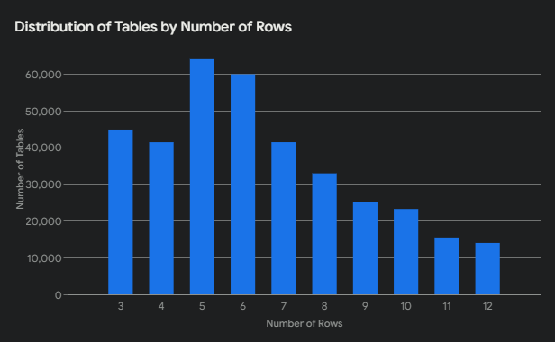
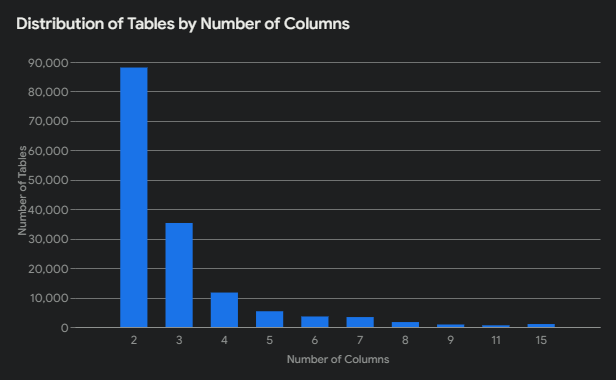

# Dataset Analysis
## Implementation
The (python) script in the `dataset_processing` folder is used to (split and then) process a JSON file containing table data, extracts relevant information, and generates a new JSON file with the processed data for further indexing with Apache Lucene. It also calculates and prints the statistics about the tables.

### Functions
- `extract_table_data(json_data, table_data)`:
Extracts column headers and cell data from the JSON object json_data.
Organizes the data into the table_data dictionary, where keys are column names and values are lists of cell values.
Filters out empty values and duplicates within each column.
Returns the maximum row and column indices, along with the count of null values.

- `process_distribution(distribution_data, rows, columns)`:
Updates the distribution_data dictionary to track the frequency of different row and column counts in the tables.

## Statistics
- Number of tables: 550,268
- Median number of rows: 17.956828309114833
- Median number of columns: 3.5276846918228935
- Median number of null values: 7.69185197031264e-05

# Experiments
## Implementation
The `MergeList` class creates a Lucene index from a JSON file and performs searches on that index. It specifically focuses on a JSON structure (created in the step before) where values are associated with column names. The search functionality aims to find columns that contain multiple specified query tokens.

### Functions
- `createIndex(String filepath)`:
Reads a JSON file and iterates over the JSON object's keys (column names) and values (arrays of values).
For each value in an array, it adds a Lucene document with two fields:
    - `valueName`: Stores the individual value.
    - `columnName`: Stores the associated column name.

- `search(String path)`:
Defines an array of queryTokens to search for.
Initializes a map `set2count` to track the number of intersecting tokens for each column name.
For each queryToken:
    - Creates a Lucene query to search for the token in the valueName field.
    - Executes the query and gets the matching documents.
For each matching document:
    - Retrieves the column names associated with the document.
    - Increments the count in `set2count` for each column name.
Finally, it creates a priority queue `sortedCandidates` to sort column names by their intersecting token count in descending order.
Prints the top k (in this case, 3) column names with their intersecting token counts.

## First Experiment
The first experiment was done on a very reduced version of the tables.json, in particular with only `6813 tables`.
The results were the following:
- Dataset processing: 12.69 seconds
- Index creation: 2.13 seconds

## Second Experiment
The second experiment was done on a reduced version of the tables.json (a quarter of it, done with the split script), so with only `137567 tables`.
The results were the following:
- Dataset processing: 5908.53 seconds ~ 1 hour
- Index creation: 34.19 seconds

## Final Experiment
The final experiment was done on the entire tables.json dataset, so with `550,268 tables`.
The results were the following:
- Dataset processing: 23,634.12 seconds ~ 4.5 hours
- Index creation: 200.5 seconds