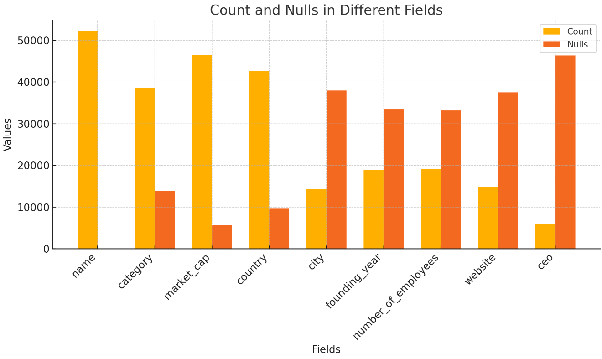

# Relazione sull'esperimento di Data Integration

## Descrizione del dataset

Il dataset utilizzato presenta informazioni riguardanti diverse aziende a livello globale. Gli attributi presenti includono:

- Nome dell'azienda
- Sede (paese e città)
- Anno di fondazione
- Numero di dipendenti
- Altri attributi come il settore, le revenue, il market cap, ecc.

## Eterogeneità riscontrate

Durante l'integrazione dei dati, sono emerse alcune eterogeneità, principalmente a due livelli:

1. **Formato delle sorgenti dati**: 
   - I dati provenivano da sorgenti eterogenee, tra cui file CSV e JSON.

2. **Schema dei dati**:
   - I nomi delle colonne differivano tra le varie sorgenti. Ad esempio:
     - Il settore dell'azienda veniva indicato in modi diversi, come `categoria` o `industria`.
     - La sede veniva espressa con variabili come `location`, `country` o `city`.
   - Altri problemi riguardavano la suddivisione temporale di alcune informazioni, come il **market cap** o le **revenue**, che in alcune sorgenti erano ripartite per anno, così come il numero dei dipendenti.

## Valori mancanti

Una delle caratteristiche principali del dataset era la presenza di numerosi valori nulli in quasi tutte le colonne, ad eccezione di:

- Nome dell'azienda
- Categoria (settore/industria)
- Sede
- Market cap

## Scelta dello schema mediato

Nella definizione dello schema mediato ho tenuto conto delle eterogeneità riscontrate e della presenza di dati mancanti. Lo schema mediato scelto è il seguente:

- `name` (Nome dell'azienda)
- `category` (Categoria o settore dell'azienda)
- `market_cap` (Capitalizzazione di mercato)
- `country` (Paese della sede)
- `city` (Città della sede)
- `founding_year` (Anno di fondazione)
- `number_of_employees` (Numero di dipendenti)
- `website` (Sito web aziendale)
- `ceo` (Amministratore delegato)

Questa struttura permette di integrare i dati in modo omogeneo, mantenendo le informazioni principali necessarie per l'analisi.

## Valori nulli

Una delle problematiche principali del dataset è l'elevato numero di valori nulli presenti in molte colonne. Questo ha richiesto un'attenzione particolare nella fase di integrazione dei dati.

## Integrazione dei dati

Per integrare i dati, il primo passo è stato trasformare tutti i file JSON in formato CSV. La scelta del formato CSV è stata motivata da diversi fattori:

- **Maggiore comprensibilità**: Il formato CSV rende più facile visualizzare i dati e capire come sono distribuiti i valori per ogni entry.
- **Facilità di confronto**: Ordinando le entry per nome, è possibile confrontare le varie entry tra di loro in maniera più semplice.

## Schema Alignment
Per la fase di **schema alignment**, ho implementato una soluzione custom basata su un LLM. In particolare, per ogni dataset, invoco l'API di **Gemini**, hostata su un progetto **Google Cloud Platform**, utilizzando un prompt specifico. L'obiettivo di questo prompt è associare ciascuna colonna del dataset a una delle colonne definite nello **schema mediato**.

- **Attribute matching**: Il sistema deve restituire una risposta in formato JSON che mappa ogni colonna del dataset al nome della colonna corrispondente nello schema mediato. Se non c'è una corrispondenza tra una colonna del dataset e lo schema mediato, quella colonna non viene inclusa nel JSON. Per facilitare la mappatura, i primi cinque record del dataset vengono forniti come esempio. In base ai valori presenti in queste colonne, il sistema decide come assegnarli allo schema mediato.

- **Schema mapping**: Una volta ricevuta la risposta JSON, utilizzo **Pandas** per rinominare le colonne del dataset in modo coerente con lo schema mediato. Questa operazione semplifica l'integrazione dei dati all'interno del sistema.

## Preprocessing dei dati

Dopo l'allineamento delle colonne, procedo con il **preprocessing** dei dati, che include le seguenti fasi:

1. **Rimozione delle colonne non mappate**: Elimino tutte le colonne dei dataset che non fanno parte dello schema mediato.
   
2. **Aggiunta delle colonne mancanti**: Se alcune colonne dello schema mediato non sono state trovate nel dataset, vengono aggiunte come colonne vuote.

3. **Pulizia delle colonne**: Effettuo delle operazioni di pulizia su alcune colonne, come:
   - **Market cap**: Normalizzazione o correzione dei valori non validi o mancanti.
   - **Anno di fondazione**: Correzione dei formati o eventuali valori mancanti.

Queste operazioni assicurano che i dati siano coerenti con lo schema mediato, preparandoli per le fasi successive dell'integrazione.

## Strategia di blocking

Dopo la conversione, ho verificato la colonna `name` (nome dell'azienda) e ho osservato una buona coerenza. Le entry provenienti da dataset diversi erano state correttamente etichettate con lo stesso nome, facilitando il processo di integrazione.
La prima strategia di **blocking** che ho implementato si è basata proprio sulla colonna `name`. Considerando la coerenza dei nomi, ho deciso di utilizzare questa colonna come punto di riferimento per il **pairwise matching**. Il risultato di questa operazione ha costituito il mio **golden dataset**, poiché con questo semplice blocking i risultati del **record linkage** erano molto buoni e non richiedevano ulteriori ottimizzazioni.

## Pairwise Matching

- **Calcolo delle similarità**: Ogni colonna viene confrontata utilizzando una specifica funzione di similarità. Confronto dei valori delle colonne name, category e country tra le coppie di record utilizzando l'algoritmo Jaro-Winkler. Il risultato è una matrice che rappresenta il grado di somiglianza tra i record per ogni colonna. Viene calcolata una media ponderata dei punteggi di similarità per ogni coppia di record, utilizzando pesi diversi per le colonne.

- **Filtraggio delle corrispondenze**: Vengono selezionate solo le coppie con un punteggio pari o superiore a 0.7, considerando queste come potenziali corrispondenze (matches). Questo valore di soglia serve a filtrare le corrispondenze meno rilevanti, mantenendo solo quelle con un grado di similarità più elevato.

## Confronto con altre strategie di blocking

Per avere un termine di confronto, ho implementato anche diverse strategie di blocking casuali. Ho creato n blocchi randomici, ognuno contenente 10.000.000 di possibili coppie, e ho calcolato la media dei risultati ottenuti. Questo confronto ha evidenziato l'efficacia del blocking basato sulla colonna `name`, dimostrando come una scelta mirata possa produrre risultati nettamente superiori rispetto a un approccio casuale. 

I risultati:
- **average_precision**: `0.23274681313109075`
- **average_recall**: `0.005657680417511552`
- **average_fscore**: `0.011046479277248967`

